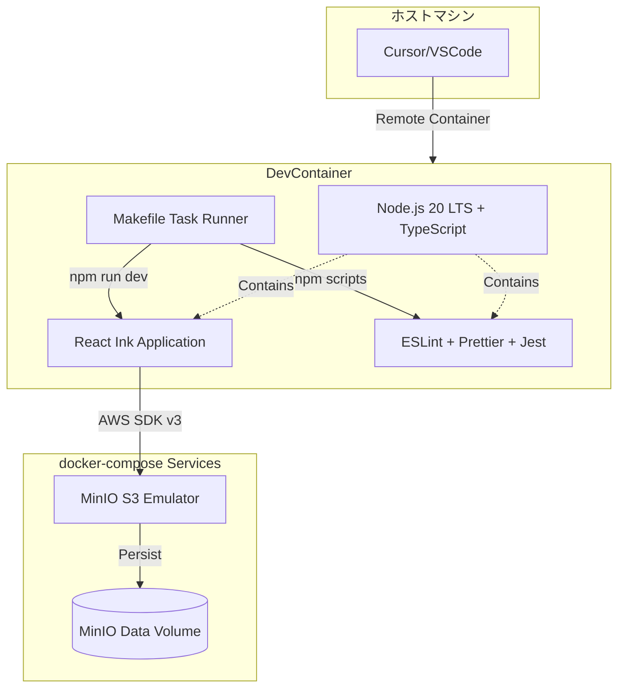
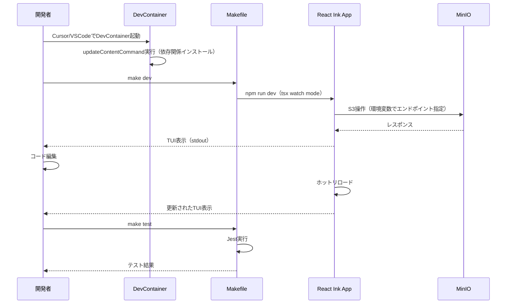
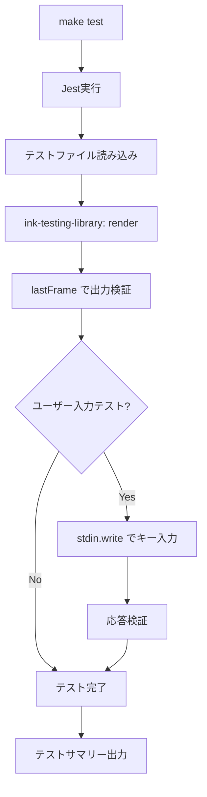

# Design Document

## Overview

本機能は、React Inkフレームワークを使用したTUI（Text-based User Interface）アプリケーション開発のための、再現性の高いコンテナ化された開発環境を提供します。

**Purpose**: DevContainer、Makefile、最新のReact Inkフレームワーク、S3エミュレーション環境を統合し、開発者が即座に生産的な開発を開始できる環境を構築します。

**Users**: TUIアプリケーション開発者は、ローカル環境の差異を気にせず、統一されたコマンドインターフェース（Makefile）を通じて、コーディング、テスト、リント、フォーマット、S3ストレージ連携開発を実行します。

**Impact**: ゼロから開発環境をセットアップする時間を削減し、チーム全体で一貫した開発体験を提供します。docker-composeによるMinIOエミュレーターにより、本番S3への依存なしにストレージ機能の開発・テストが可能になります。

### Goals

- DevContainerによる完全コンテナ化された開発環境の提供
- Makefileを通じた統一されたタスク実行インターフェース（test, lint, format, dev, logs, cleanup）
- React Ink最新版とTypeScript strictモードによる型安全なTUI開発基盤
- Jest + ink-testing-libraryによる包括的なテスト環境
- MinIOによるローカルS3エミュレーション環境
- 自動化された依存関係管理とツールチェーン統合

### Non-Goals

- 本番環境のデプロイ設定（CI/CD、Kubernetes等）は対象外
- TUIアプリケーションの具体的なビジネスロジック実装は対象外
- S3以外のAWSサービス（DynamoDB、Lambda等）のエミュレーションは対象外
- マルチプラットフォームバイナリ配布（pkg、nexe等）は将来検討
- パフォーマンスベンチマークツールの統合は対象外

## Architecture

### Architecture Pattern & Boundary Map

**選定パターン**: Container-First Development with Feature-Sliced Structure

開発環境全体をDevContainerとdocker-composeで管理し、アプリケーションコード内部はFeature-Sliced Designで機能単位に分離します。



**Architecture Integration**:
- **Selected pattern**: Container-First Development — 環境差異を排除し、再現性を最大化
- **Domain/feature boundaries**:
  - Development Infrastructure（DevContainer、docker-compose）
  - Build Toolchain（Makefile、npm scripts）
  - Application Runtime（React Ink、Node.js）
  - Testing Infrastructure（Jest、ink-testing-library）
  - Storage Emulation（MinIO）
- **Existing patterns preserved**: なし（新規プロジェクト）
- **New components rationale**: 各コンポーネントは開発ライフサイクルの異なるフェーズを担当し、疎結合
- **Steering compliance**: steering未設定のため、業界標準ベストプラクティスに準拠

### Technology Stack

| Layer | Choice / Version | Role in Feature | Notes |
|-------|------------------|-----------------|-------|
| Frontend / CLI | React Ink ^4.0.0 | TUIコンポーネントフレームワーク | 最新安定版、TypeScript完全サポート |
| Frontend / CLI | TypeScript ^5.0.0 | 型安全性保証 | strict mode有効 |
| Backend / Services | - | - | 該当なし（CLI環境） |
| Data / Storage | MinIO latest | ローカルS3エミュレーター | docker-composeで起動 |
| Data / Storage | AWS SDK v3 | S3クライアント | 環境変数でエンドポイント切り替え |
| Messaging / Events | - | - | 該当なし |
| Infrastructure / Runtime | Node.js 20 LTS | JavaScriptランタイム | DevContainer標準イメージ |
| Infrastructure / Runtime | DevContainer (mcr.microsoft.com/devcontainers/typescript-node:0-20) | コンテナ化開発環境 | VSCode/Cursor互換 |
| Infrastructure / Runtime | docker-compose v2 | マルチコンテナオーケストレーション | MinIO管理 |
| Infrastructure / Runtime | Make 3.81+ | タスクランナー | クロスプラットフォーム統一インターフェース |
| Testing | Jest ^29.0.0 | テストフレームワーク | TypeScript対応 |
| Testing | ink-testing-library ^3.0.0 | TUIコンポーネントテストユーティリティ | React Testing Library風API |
| Linting | ESLint ^8.0.0 | 静的解析ツール | TypeScript/React対応 |
| Formatting | Prettier ^3.0.0 | コードフォーマッタ | eslint-config-prettierで競合解決 |

## System Flows

### 開発者ワークフロー



**Key Decisions**:
- tsx watch modeでホットリロードを実現、開発サイクルを高速化
- MinIOへの接続は環境変数（`AWS_ENDPOINT_URL`）で制御、本番切り替えが容易
- Makefileが全タスクのエントリーポイント、一貫したインターフェース提供

### テスト実行フロー



## Requirements Traceability

| Requirement | Summary | Components | Interfaces | Flows |
|-------------|---------|------------|------------|-------|
| 1.1 | DevContainer設定提供 | DevContainerConfig | devcontainer.json | - |
| 1.2 | Node.js環境自動セットアップ | DevContainerConfig | devcontainer.json (image) | 開発者ワークフロー |
| 1.3 | Cursor拡張機能自動インストール | DevContainerConfig | devcontainer.json (customizations) | - |
| 1.4 | 依存関係自動インストール | DevContainerConfig | devcontainer.json (updateContentCommand) | - |
| 1.5 | ファイルシステムマウント | DevContainerConfig | devcontainer.json (mounts) | - |
| 2.1-2.5 | React Ink統合 | PackageManifest, AppEntryPoint | package.json, src/cli.tsx | 開発者ワークフロー |
| 3.1-3.12 | Makefileタスク | Makefile | make targets | - |
| 4.1-4.5 | テストフレームワーク | JestConfig, TestUtils | jest.config.js, *.test.tsx | テスト実行フロー |
| 5.1-5.5 | ESLint設定 | ESLintConfig | .eslintrc.json | - |
| 6.1-6.5 | Prettier設定 | PrettierConfig | .prettierrc.json | - |
| 7.1-7.5 | TypeScript設定 | TSConfig | tsconfig.json | - |
| 8.1-8.5 | 依存関係管理 | PackageManifest | package.json, package-lock.json | - |
| 9.1-9.5 | 開発ワークフロー | DevScript | npm scripts, tsx | 開発者ワークフロー |
| 10.1-10.8 | S3エミュレーション | DockerComposeConfig, MinIOSetup | docker-compose.yml, scripts/init-minio.sh | 開発者ワークフロー |
| 11.1-11.7 | ドキュメンテーション | README | README.md | - |

## Components and Interfaces

### Components Summary

| Component | Domain/Layer | Intent | Req Coverage | Key Dependencies (P0/P1) | Contracts |
|-----------|--------------|--------|--------------|--------------------------|-----------|
| DevContainerConfig | Infrastructure | DevContainer環境定義 | 1.1-1.5 | Node.js 20 LTS image (P0) | Config File |
| DockerComposeConfig | Infrastructure | MinIO起動定義 | 10.1-10.3, 10.7 | MinIO image (P0) | Config File |
| MinIOSetup | Infrastructure | 初期バケット作成 | 10.8 | MinIO Client mc (P0) | Shell Script |
| Makefile | Build Toolchain | タスク統合 | 3.1-3.12 | npm (P0), node_modules (P0) | CLI Interface |
| PackageManifest | Build Toolchain | 依存関係定義 | 2.1, 8.1-8.5 | npm (P0) | Config File |
| TSConfig | Build Toolchain | TypeScript設定 | 7.1-7.5 | TypeScript (P0) | Config File |
| ESLintConfig | Build Toolchain | リント設定 | 5.1-5.5 | ESLint (P0), eslint-config-prettier (P0) | Config File |
| PrettierConfig | Build Toolchain | フォーマッタ設定 | 6.1-6.5 | Prettier (P0) | Config File |
| JestConfig | Testing | テスト設定 | 4.1 | Jest (P0), ts-jest (P0) | Config File |
| AppEntryPoint | Application | TUIアプリエントリーポイント | 2.3, 9.1-9.5 | React Ink (P0), AWS SDK (P1) | TypeScript Module |
| README | Documentation | セットアップガイド | 11.1-11.7 | - | Markdown |

### Infrastructure

#### DevContainerConfig

| Field | Detail |
|-------|--------|
| Intent | VSCode/Cursor用DevContainer設定を提供し、一貫した開発環境を保証 |
| Requirements | 1.1, 1.2, 1.3, 1.4, 1.5 |

**Responsibilities & Constraints**
- ベースイメージ指定（`mcr.microsoft.com/devcontainers/typescript-node:0-20`）
- 拡張機能自動インストール（ESLint、Prettier、TypeScript）
- ライフサイクルコマンド定義（`updateContentCommand`, `postStartCommand`）
- ポートフォワーディング設定

**Dependencies**
- External: Microsoft DevContainer base image (P0) — Node.js 20 LTS環境提供
- External: docker-compose (P1) — MinIO起動に必要

**Contracts**: Config File [x]

**Config File Structure**
```json
{
  "name": "React Ink Dev Environment",
  "image": "mcr.microsoft.com/devcontainers/typescript-node:0-20",
  "customizations": {
    "vscode": {
      "extensions": [
        "dbaeumer.vscode-eslint",
        "esbenp.prettier-vscode",
        "ms-vscode.vscode-typescript-next"
      ]
    }
  },
  "updateContentCommand": "npm install",
  "postStartCommand": "echo 'DevContainer ready'",
  "forwardPorts": [3000, 9000, 9001],
  "mounts": [
    "source=${localWorkspaceFolder},target=/workspaces/${localWorkspaceFolderBasename},type=bind"
  ]
}
```

**Implementation Notes**
- Integration: `.devcontainer/devcontainer.json`に配置
- Validation: VSCode/CursorでDevContainer起動時に自動検証
- Risks: 初回起動時のイメージダウンロードに時間がかかる（README.mdに記載）

#### DockerComposeConfig

| Field | Detail |
|-------|--------|
| Intent | MinIO S3エミュレーターをdocker-composeで起動・管理 |
| Requirements | 10.1, 10.2, 10.3, 10.7 |

**Responsibilities & Constraints**
- MinIOコンテナ定義（ポート9000: S3 API、ポート9001: Web UI）
- データ永続化ボリューム設定
- 環境変数でアクセスキー/シークレットキー設定

**Dependencies**
- External: MinIO Docker image (P0) — S3互換ストレージエミュレーター

**Contracts**: Config File [x]

**Config File Structure**
```yaml
version: '3.8'

services:
  minio:
    image: minio/minio:latest
    container_name: react-ink-minio
    ports:
      - "9000:9000"
      - "9001:9001"
    environment:
      MINIO_ROOT_USER: minioadmin
      MINIO_ROOT_PASSWORD: minioadmin
    command: server /data --console-address ":9001"
    volumes:
      - minio_data:/data
    healthcheck:
      test: ["CMD", "curl", "-f", "http://localhost:9000/minio/health/live"]
      interval: 30s
      timeout: 10s
      retries: 3

volumes:
  minio_data:
    driver: local
```

**Implementation Notes**
- Integration: `docker-compose.yml`をプロジェクトルートに配置
- Validation: `docker-compose up -d`で起動、`http://localhost:9001`でWeb UI確認
- Risks: MinIOとAWS S3の完全互換性は保証されない（統合テストで両環境検証）

#### MinIOSetup

| Field | Detail |
|-------|--------|
| Intent | MinIO起動後の初期セットアップ（バケット作成）を自動化 |
| Requirements | 10.8 |

**Responsibilities & Constraints**
- デフォルトバケット作成
- バケットポリシー設定（必要に応じて）

**Dependencies**
- Inbound: Makefile (P1) — `make init-minio`ターゲットから呼び出し
- External: MinIO Client (mc) (P0) — バケット操作CLI

**Contracts**: Shell Script [x]

**Shell Script Interface**
```bash
#!/bin/bash
# scripts/init-minio.sh

# MinIO CLIエイリアス設定
mc alias set local http://localhost:9000 minioadmin minioadmin

# デフォルトバケット作成
mc mb local/my-app-bucket --ignore-existing

# バケット一覧確認
mc ls local

echo "MinIO setup complete"
```

**Implementation Notes**
- Integration: `scripts/`ディレクトリに配置、Makefileの`init-minio`ターゲットから実行
- Validation: スクリプト実行後、`http://localhost:9001`でバケット存在確認
- Risks: MinIO未起動時のエラーハンドリング必要（healthcheckと連携）

### Build Toolchain

#### Makefile

| Field | Detail |
|-------|--------|
| Intent | 統一されたタスク実行インターフェースを提供 |
| Requirements | 3.1, 3.2, 3.3, 3.4, 3.5, 3.6, 3.7, 3.8, 3.9, 3.10, 3.11, 3.12 |

**Responsibilities & Constraints**
- 全タスクターゲット定義（test, lint, format, cleanup, dev, logs）
- npm scriptsへの委譲
- タスク依存関係管理

**Dependencies**
- Outbound: npm scripts (P0) — 実際のツール実行
- Outbound: docker-compose (P1) — MinIO起動/停止

**Contracts**: CLI Interface [x]

**CLI Interface**
```makefile
.PHONY: help test lint format cleanup dev logs init-minio pull build up down

BIN := ./node_modules/.bin

help: ## ヘルプ表示
	@grep -E '^[a-zA-Z_-]+:.*?## .*$$' $(MAKEFILE_LIST) | \
		awk 'BEGIN {FS = ":.*?## "}; {printf "\033[36m%-15s\033[0m %s\n", $$1, $$2}'

test: ## テスト実行
	npm test

lint: ## リント実行
	npm run lint

format: ## フォーマット実行
	npm run format

cleanup: ## クリーンアップ（node_modules、coverage等削除）
	rm -rf node_modules coverage dist .turbo

dev: ## 開発モード起動
	npm run dev

logs: ## ログtail表示
	tail -f logs/app.log 2>/dev/null || echo "No logs found"

init-minio: ## MinIO初期セットアップ
	./scripts/init-minio.sh

pull: ## docker-composeイメージをpull
	docker-compose pull

build: ## docker-composeイメージをbuild（将来のカスタムビルド用）
	docker-compose build

up: pull ## docker-compose起動（初回はpull実行）
	docker-compose up -d

down: ## docker-compose停止
	docker-compose down
```

**Implementation Notes**
- Integration: プロジェクトルートに`Makefile`配置
- Validation: `make help`で全ターゲット一覧表示
- Risks: Windows環境でMake未インストール（README.mdにWSL/Git Bash推奨記載）

#### PackageManifest

| Field | Detail |
|-------|--------|
| Intent | npm依存関係とscriptsを定義 |
| Requirements | 2.1, 8.1, 8.2, 8.3, 8.4, 8.5 |

**Responsibilities & Constraints**
- React Ink、TypeScript、テストツール等の依存関係管理
- npm scriptsでタスク実行コマンド定義

**Dependencies**
- External: npm registry (P0) — パッケージダウンロード

**Contracts**: Config File [x]

**Config File Structure**
```json
{
  "name": "react-ink-dev-environment",
  "version": "1.0.0",
  "type": "module",
  "engines": {
    "node": ">=20.0.0"
  },
  "scripts": {
    "dev": "tsx watch src/cli.tsx",
    "build": "tsc",
    "test": "jest",
    "test:watch": "jest --watch",
    "lint": "eslint . --ext .ts,.tsx",
    "lint:fix": "eslint . --ext .ts,.tsx --fix",
    "format": "prettier --write \"src/**/*.{ts,tsx,json,md}\"",
    "format:check": "prettier --check \"src/**/*.{ts,tsx,json,md}\""
  },
  "dependencies": {
    "ink": "^4.0.0",
    "react": "^18.0.0",
    "@aws-sdk/client-s3": "^3.0.0"
  },
  "devDependencies": {
    "@types/node": "^20.0.0",
    "@types/react": "^18.0.0",
    "typescript": "^5.0.0",
    "tsx": "^4.0.0",
    "jest": "^29.0.0",
    "ts-jest": "^29.0.0",
    "ink-testing-library": "^3.0.0",
    "@testing-library/jest-dom": "^6.0.0",
    "eslint": "^8.0.0",
    "@typescript-eslint/eslint-plugin": "^6.0.0",
    "@typescript-eslint/parser": "^6.0.0",
    "eslint-config-prettier": "^9.0.0",
    "eslint-plugin-prettier": "^5.0.0",
    "prettier": "^3.0.0"
  }
}
```

**Implementation Notes**
- Integration: プロジェクトルートに配置
- Validation: `npm install`で依存関係解決確認
- Risks: バージョン競合（package-lock.jsonでロック）

#### TSConfig

| Field | Detail |
|-------|--------|
| Intent | TypeScript strictモード設定 |
| Requirements | 7.1, 7.2, 7.3, 7.4, 7.5 |

**Responsibilities & Constraints**
- strict mode有効化
- React JSX変換設定
- Node.js環境用型定義

**Dependencies**
- External: TypeScript compiler (P0)

**Contracts**: Config File [x]

**Config File Structure**
```json
{
  "compilerOptions": {
    "target": "ES2022",
    "module": "ESNext",
    "lib": ["ES2022"],
    "moduleResolution": "node",
    "jsx": "react-jsx",
    "jsxImportSource": "react",
    "strict": true,
    "esModuleInterop": true,
    "skipLibCheck": true,
    "forceConsistentCasingInFileNames": true,
    "resolveJsonModule": true,
    "isolatedModules": true,
    "noEmit": true,
    "noUnusedLocals": true,
    "noUnusedParameters": true,
    "noFallthroughCasesInSwitch": true,
    "types": ["node", "jest"]
  },
  "include": ["src/**/*"],
  "exclude": ["node_modules", "dist", "coverage"]
}
```

**Implementation Notes**
- Integration: プロジェクトルートに配置
- Validation: `tsc --noEmit`で型チェック
- Risks: strictモードによる初期学習コスト（ドキュメントで対応）

#### ESLintConfig

| Field | Detail |
|-------|--------|
| Intent | TypeScript/React向けリント設定 |
| Requirements | 5.1, 5.2, 5.3, 5.4, 5.5 |

**Responsibilities & Constraints**
- TypeScript/Reactベストプラクティスルール適用
- Prettierとの競合解決

**Dependencies**
- External: ESLint (P0), eslint-config-prettier (P0)

**Contracts**: Config File [x]

**Config File Structure**
```json
{
  "parser": "@typescript-eslint/parser",
  "parserOptions": {
    "ecmaVersion": 2022,
    "sourceType": "module",
    "ecmaFeatures": {
      "jsx": true
    },
    "project": "./tsconfig.json"
  },
  "extends": [
    "eslint:recommended",
    "plugin:@typescript-eslint/recommended",
    "plugin:@typescript-eslint/recommended-requiring-type-checking",
    "plugin:react/recommended",
    "plugin:react-hooks/recommended",
    "plugin:prettier/recommended"
  ],
  "plugins": ["@typescript-eslint", "react", "react-hooks"],
  "rules": {
    "@typescript-eslint/no-explicit-any": "error",
    "@typescript-eslint/explicit-function-return-type": "warn",
    "react/react-in-jsx-scope": "off"
  },
  "settings": {
    "react": {
      "version": "detect"
    }
  }
}
```

**Implementation Notes**
- Integration: プロジェクトルートに`.eslintrc.json`配置
- Validation: `npm run lint`でルール適用確認
- Risks: ルール厳格化による既存コード修正コスト（段階的導入）

#### PrettierConfig

| Field | Detail |
|-------|--------|
| Intent | コードスタイル統一 |
| Requirements | 6.1, 6.2, 6.3, 6.4, 6.5 |

**Responsibilities & Constraints**
- TypeScript、JSON、Markdownフォーマット
- ESLintと競合しない設定

**Dependencies**
- External: Prettier (P0)

**Contracts**: Config File [x]

**Config File Structure**
```json
{
  "semi": true,
  "trailingComma": "all",
  "singleQuote": true,
  "printWidth": 100,
  "tabWidth": 2,
  "useTabs": false,
  "arrowParens": "avoid",
  "endOfLine": "lf"
}
```

**Implementation Notes**
- Integration: プロジェクトルートに`.prettierrc.json`配置
- Validation: `npm run format:check`でフォーマット違反検出
- Risks: チームメンバー間の設定統一（DevContainerで自動適用）

### Testing Infrastructure

#### JestConfig

| Field | Detail |
|-------|--------|
| Intent | Jest + ink-testing-library統合設定 |
| Requirements | 4.1, 4.3 |

**Responsibilities & Constraints**
- TypeScript変換設定（ts-jest）
- ink-testing-library統合
- カバレッジ設定

**Dependencies**
- External: Jest (P0), ts-jest (P0), ink-testing-library (P0)

**Contracts**: Config File [x]

**Config File Structure**
```javascript
export default {
  preset: 'ts-jest',
  testEnvironment: 'node',
  roots: ['<rootDir>/src'],
  testMatch: ['**/__tests__/**/*.ts?(x)', '**/?(*.)+(spec|test).ts?(x)'],
  transform: {
    '^.+\\.tsx?$': [
      'ts-jest',
      {
        tsconfig: {
          jsx: 'react-jsx',
        },
      },
    ],
  },
  collectCoverageFrom: [
    'src/**/*.{ts,tsx}',
    '!src/**/*.d.ts',
    '!src/**/*.test.{ts,tsx}',
  ],
  coverageDirectory: 'coverage',
  coverageReporters: ['text', 'lcov', 'html'],
  moduleFileExtensions: ['ts', 'tsx', 'js', 'jsx', 'json'],
};
```

**Implementation Notes**
- Integration: プロジェクトルートに`jest.config.js`配置
- Validation: `npm test`でテスト実行確認
- Risks: ink-testing-libraryの非同期レンダリングテストが複雑（サンプル提供）

### Application Runtime

#### AppEntryPoint

| Field | Detail |
|-------|--------|
| Intent | React Inkアプリケーションのエントリーポイント |
| Requirements | 2.3, 9.1, 9.2, 9.3, 9.4, 9.5 |

**Responsibilities & Constraints**
- render()関数でReactコンポーネントマウント
- 環境変数でS3接続先切り替え
- エラーハンドリングとログ出力

**Dependencies**
- Inbound: npm run dev (P0) — tsx watch modeで起動
- Outbound: React Ink (P0) — TUIレンダリング
- Outbound: AWS SDK v3 (P1) — S3操作

**Contracts**: TypeScript Module [x]

**TypeScript Module Interface**
```typescript
// src/cli.tsx
import React from 'react';
import { render, Box, Text } from 'ink';
import { S3Client, ListBucketsCommand } from '@aws-sdk/client-s3';

interface AppProps {
  name?: string;
}

const App: React.FC<AppProps> = ({ name = 'World' }) => {
  const [buckets, setBuckets] = React.useState<string[]>([]);
  const [error, setError] = React.useState<string | null>(null);

  React.useEffect(() => {
    const s3Client = new S3Client({
      region: 'us-east-1',
      endpoint: process.env.AWS_ENDPOINT_URL || undefined,
      credentials: process.env.AWS_ENDPOINT_URL
        ? {
            accessKeyId: 'minioadmin',
            secretAccessKey: 'minioadmin',
          }
        : undefined,
    });

    const fetchBuckets = async () => {
      try {
        const response = await s3Client.send(new ListBucketsCommand({}));
        const names = response.Buckets?.map(b => b.Name ?? 'unknown') ?? [];
        setBuckets(names);
      } catch (err) {
        setError(err instanceof Error ? err.message : 'Unknown error');
      }
    };

    void fetchBuckets();
  }, []);

  return (
    <Box flexDirection="column" padding={1}>
      <Text color="green" bold>
        Hello, {name}!
      </Text>
      <Text dimColor>React Ink TUI Application</Text>
      <Box marginTop={1}>
        <Text>S3 Buckets:</Text>
      </Box>
      {error ? (
        <Text color="red">Error: {error}</Text>
      ) : (
        buckets.map(bucket => (
          <Text key={bucket}>  - {bucket}</Text>
        ))
      )}
    </Box>
  );
};

render(<App name="Developer" />);
```

**Preconditions**:
- MinIOが起動していること（docker-compose up）
- 環境変数`AWS_ENDPOINT_URL=http://localhost:9000`が設定されていること（ローカル開発時）

**Postconditions**:
- TUIがstdoutに表示される
- S3バケット一覧が取得・表示される

**Implementation Notes**
- Integration: `src/cli.tsx`に配置、`npm run dev`で実行
- Validation: `AWS_ENDPOINT_URL=http://localhost:9000 npm run dev`でMinIO接続確認
- Risks: MinIO未起動時のエラーメッセージが不明瞭（try-catchで対応）

### Documentation

#### README

| Field | Detail |
|-------|--------|
| Intent | 開発環境セットアップ手順とコマンドリファレンスを提供 |
| Requirements | 11.1, 11.2, 11.3, 11.4, 11.5, 11.6, 11.7 |

**Responsibilities & Constraints**
- DevContainer起動手順
- docker-compose起動手順
- Makeコマンド一覧
- React Inkサンプルコード
- トラブルシューティング

**Dependencies**
- なし

**Contracts**: Markdown [x]

**Markdown Structure Outline**
```markdown
# React Ink Development Environment

## Quick Start
1. Clone repository
2. Open in Cursor/VSCode
3. Reopen in Container
4. `make up` (MinIO起動)
5. `make init-minio` (初期セットアップ)
6. `make dev` (アプリ起動)

## Available Commands
- `make help` — コマンド一覧表示
- `make test` — テスト実行
- `make lint` — リント実行
- `make format` — フォーマット実行
- `make dev` — 開発モード起動
- `make logs` — ログtail
- `make cleanup` — クリーンアップ
- `make pull` — docker-composeイメージをpull
- `make build` — docker-composeイメージをbuild（カスタムビルド用）
- `make up` — MinIO起動（自動的にpull実行）
- `make down` — MinIO停止
- `make init-minio` — MinIO初期セットアップ

## React Ink Component Example
[サンプルコード]

## MinIO Configuration
- Web UI: http://localhost:9001
- S3 API: http://localhost:9000
- Credentials: minioadmin / minioadmin

## Troubleshooting
- DevContainer起動が遅い → 初回は10分程度かかる場合あり
- MinIO接続エラー → `make up`でコンテナ起動確認
- TypeScript型エラー → `npm install`で依存関係再インストール
```

**Implementation Notes**
- Integration: プロジェクトルートに`README.md`配置
- Validation: 新規開発者にセットアップ手順を実施してもらいフィードバック収集
- Risks: ドキュメント更新漏れ（CI/CDでリンク切れチェック推奨）

## Data Models

### Domain Model

本機能は開発環境構築のため、ビジネスドメインモデルは該当しません。以下の技術ドメインモデルを定義します。

**Development Environment Aggregate**
- DevContainerConfig（開発コンテナ設定）
- DockerComposeConfig（S3エミュレーター設定）
- BuildToolchain（Makefile、package.json、tsconfig.json等）
- TestingInfrastructure（Jest設定、テストユーティリティ）

**Invariants**:
- DevContainerイメージはNode.js 20 LTS以降を使用
- TypeScriptはstrictモード必須
- ESLintとPrettierは競合しない設定（eslint-config-prettier使用）

### Logical Data Model

#### 環境変数モデル

開発環境と本番環境を切り替えるための環境変数を定義します。

| 変数名 | 型 | 必須 | デフォルト値 | 説明 |
|--------|---|------|------------|------|
| `AWS_ENDPOINT_URL` | string | No | undefined | S3エンドポイントURL（MinIO: `http://localhost:9000`） |
| `AWS_ACCESS_KEY_ID` | string | Conditional | - | MinIO使用時: `minioadmin` |
| `AWS_SECRET_ACCESS_KEY` | string | Conditional | - | MinIO使用時: `minioadmin` |
| `AWS_REGION` | string | No | `us-east-1` | S3リージョン |
| `NODE_ENV` | string | No | `development` | 実行環境（development/production） |

**Consistency & Integrity**:
- `AWS_ENDPOINT_URL`が設定されている場合、`AWS_ACCESS_KEY_ID`と`AWS_SECRET_ACCESS_KEY`が必須
- 本番環境（`AWS_ENDPOINT_URL`未設定）では、AWS認証情報は環境またはIAMロールから取得

#### ファイルシステム構造

```
.
├── .devcontainer/
│   └── devcontainer.json
├── docker-compose.yml
├── Makefile
├── package.json
├── package-lock.json
├── tsconfig.json
├── .eslintrc.json
├── .prettierrc.json
├── jest.config.js
├── scripts/
│   └── init-minio.sh
├── src/
│   ├── cli.tsx
│   ├── components/
│   │   └── App.tsx
│   └── __tests__/
│       └── App.test.tsx
└── README.md
```

## Error Handling

### Error Strategy

TUI環境特有のエラーハンドリング戦略を採用します。

- **即座にフィードバック**: エラーは即座にTUIに表示し、ユーザーが問題を認識できるようにする
- **Graceful Degradation**: S3接続エラー時もアプリは起動し、エラーメッセージのみ表示
- **ログ出力**: 重要なエラーは標準エラー出力に記録

### Error Categories and Responses

**User Errors (4xx相当)**:
- 不正な環境変数 → 起動時にバリデーション、明確なエラーメッセージ表示
- 不明なコマンド引数 → ヘルプメッセージ表示

**System Errors (5xx相当)**:
- MinIO接続失敗 → リトライ3回、失敗時はエラーメッセージ表示（「MinIOが起動していない可能性があります」）
- AWS S3接続タイムアウト → タイムアウト10秒、circuit breaker適用

**Business Logic Errors (422相当)**:
- バケット名重複 → 既存バケット使用を提案

### Monitoring

開発環境のため、本格的なモニタリングは対象外ですが、以下を実装します。

- **Error Tracking**: エラー発生時は`console.error()`で標準エラー出力
- **Logging**: 環境変数`DEBUG=true`でデバッグログ出力
- **Health Check**: MinIOのhealthcheck設定（docker-compose.yml）

## Testing Strategy

### Unit Tests

**Core Components** (5項目):
1. `App`コンポーネント: 初期レンダリング確認（`lastFrame()`で「Hello」表示検証）
2. S3クライアント初期化ロジック: 環境変数に応じたエンドポイント設定検証
3. バケット一覧取得ロジック: モックS3レスポンスで状態更新確認
4. エラーハンドリング: S3エラー時の状態遷移検証
5. 環境変数パース: 各環境変数の優先順位検証

### Integration Tests

**Cross-Component Flows** (4項目):
1. DevContainer起動 → npm install → make test実行（CI環境で検証）
2. docker-compose up → MinIO初期化 → S3接続確認
3. make lint → ESLint実行 → エラー検出確認
4. make format → Prettier適用 → コードスタイル統一確認

### E2E/UI Tests

**Critical User Paths** (3項目):
1. DevContainer起動 → make dev → TUI表示確認（手動テスト）
2. MinIO Web UI（http://localhost:9001）→ バケット作成 → アプリで表示確認
3. コード変更 → ホットリロード → 更新されたTUI表示確認

### Performance/Load

開発環境のため、パフォーマンステストは対象外。将来的に以下を検討：
- TUIレンダリング速度測定（1000行出力時のフレームレート）
- S3同時接続数（MinIOの性能限界確認）

## Optional Sections

### Security Considerations

開発環境のため、本番環境ほどの厳格性は不要ですが、以下を考慮します。

- **認証情報管理**: MinIO認証情報はdocker-compose.ymlにハードコード（ローカル開発のみ使用）
- **環境変数検証**: `AWS_ENDPOINT_URL`が本番AWSエンドポイントでないことを確認（開発環境での誤接続防止）
- **依存関係スキャン**: `npm audit`で脆弱性チェック（Makefileに`audit`ターゲット追加検討）

### Performance & Scalability

開発環境のため、スケーラビリティ要件は該当しません。以下のパフォーマンス目標を設定します。

- **DevContainer起動時間**: 初回15分以内、2回目以降1分以内（updateContentCommand最適化）
- **ホットリロード速度**: コード変更から再表示まで3秒以内
- **テスト実行時間**: 全テストスイート30秒以内

### Migration Strategy

新規プロジェクトのため、マイグレーション戦略は該当しません。将来的に以下を検討：

- 既存TUIアプリケーションからの移行ガイド作成
- React Inkバージョンアップ時のマイグレーション手順整備
